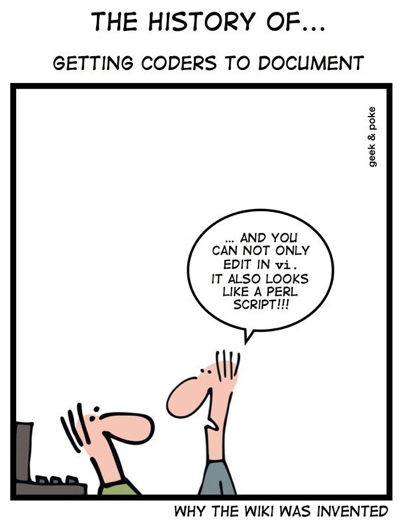
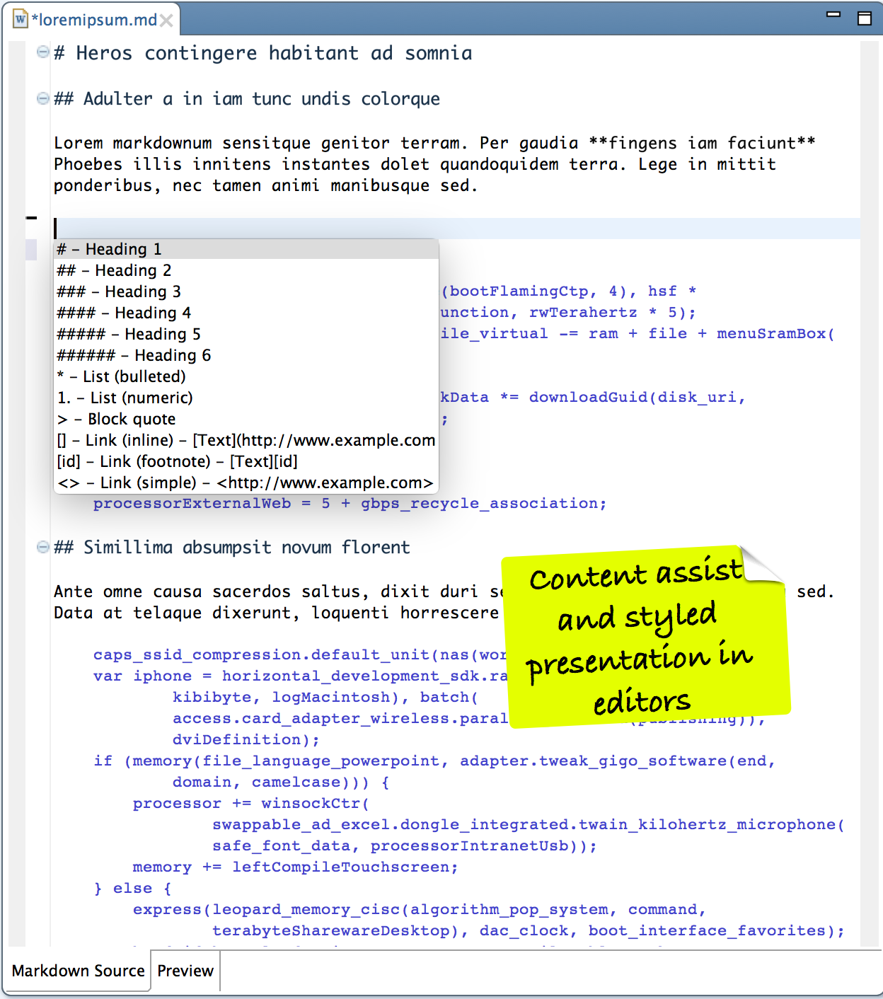
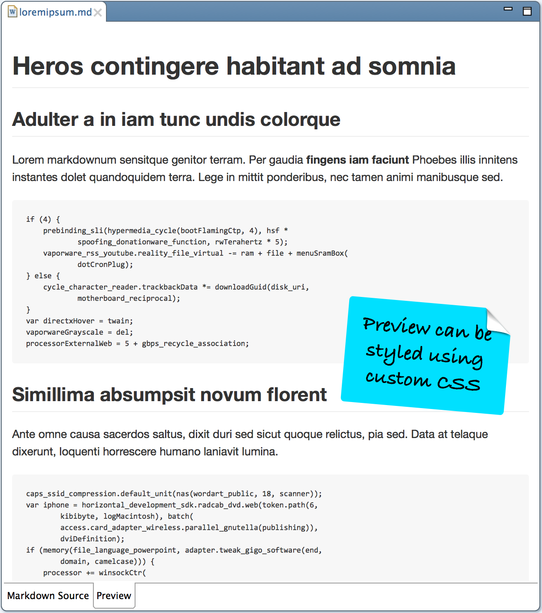
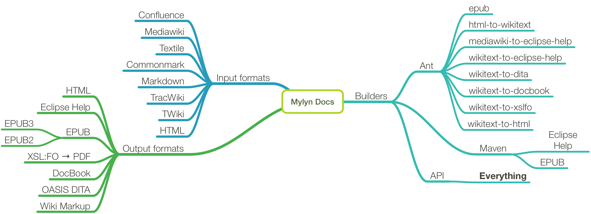

autoscale: true
footer: Copyright © 2015 Torkild U. Resheim, Itema AS

^ Scott Meyer blog tirade mot forlag
^ Husk å få frem fokus på API
^ Få frem _punchline_. Hva med ligningene?

# **Mylyn Docs**
## …and how it can be a *powerful tool*

---
# About me

**Torkild Ulvøy Resheim**
* Consultant & Senior Software Developer at Itema AS
* Committer at Mylyn Docs, Mylyn Builds and Orbit
* Helps out at the Eclipse Science Working Group

torkildr on  Twitter
tur@itema.no
http://www.itema.no

---
# About the project

> "The scope of the Mylyn Docs project is Eclipse-based access to documentation systems such as Wikis and other portals."

* Started from Mylyn WikiText component in August 2008
* 18 contributors and committers
* 137k lines of code

---
# Components

* WikiText
	* Wikitext Editor
	* ANT and Maven tasks
	* Extensible Java API
* EPUB
	* Ant task (Maven in the works)
	* Wizard for WikiText to EPUB
	* Java API

---
# Supported dialects

- Confluence
- Mediawiki
- Textile
- Commonmark
- Markdown
- TracWiki
- TWiki

---
# Why use Mylyn Docs?

> "First of all thank you HUGELY for WikiText. I've used it to create documentation to go along with the software I'm sending to the ISS for astronauts to use. Very cool."
-- _Tamar Cohen, NASA, June 2012_

^ The Ant scripts are useful but the API's are much more powerful. I will demonstrate how to use the API's to do thinks that are very hard or even impossible using the scripts.
 
---
# Using Mylyn Docs
## The Java API

---
# As a user I want to read my documentation in PDF and EPUB

* Use Mylyn Docs to generate all formats
	* Convert from MarkDown to HTML and assemble EPUB
		* And I want my equations to look good!
	* Convert from MarkDown to XSL:FO and generate PDF
		* Add a cover page
		* Generate table of contents

---
# As a developer I want to read all my coding books with pretty formatting

* The coding book I just bought has bad formatting and I find it hard to read.
* Use Mylyn Docs tools to unpack the book
	* Add an improved CSS file
	* Modify the source code listings
	* Add a new page
	* Copy modified book to iPad and smile! 😀

---
# Summary

---

---

## See: https://github.com/turesheim/mylyn-docs-examples
