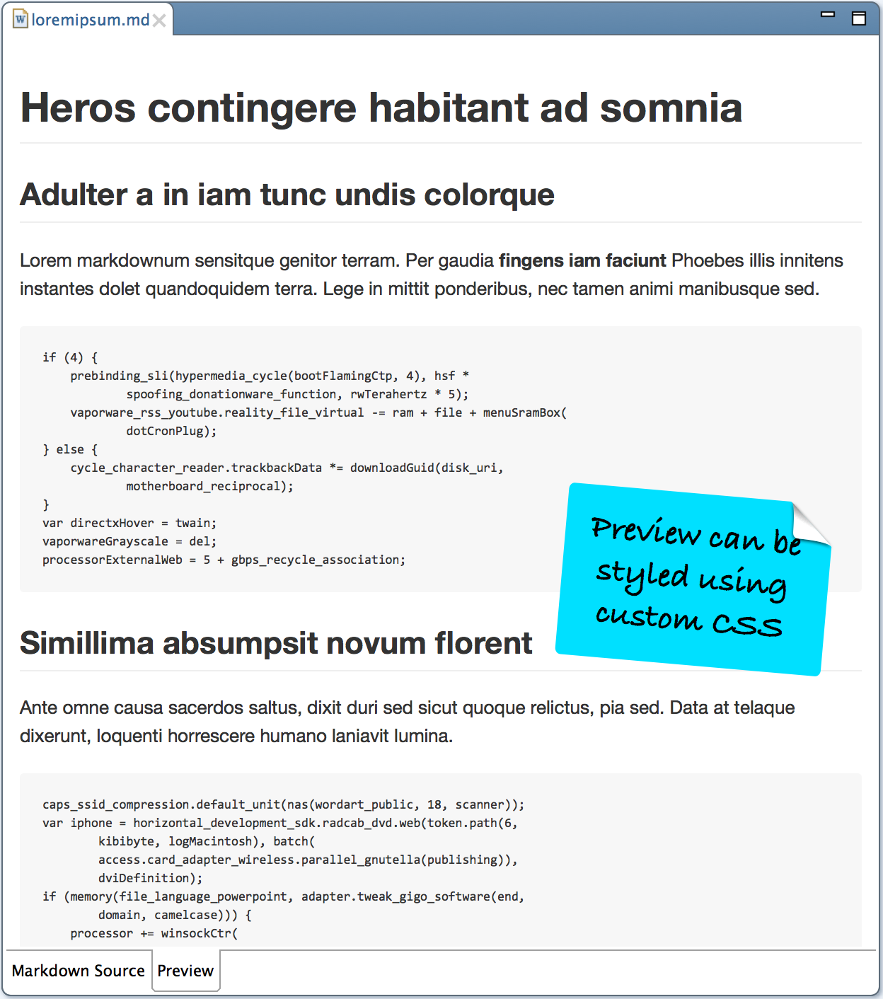
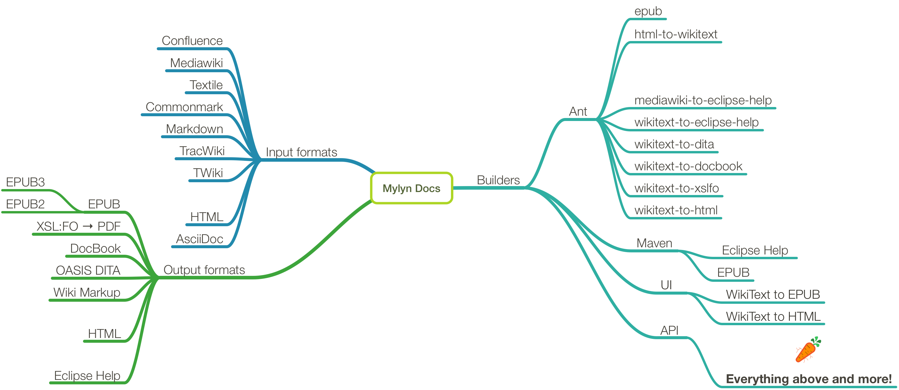

autoscale: true
footer: Copyright © 2015-2016 Torkild U. Resheim, Itema AS

# **Mylyn Docs**
## …and how it can be a *powerful tool*

---
# About me

**Torkild Ulvøy Resheim**
* Consultant & Senior Software Developer at Itema AS
* Committer at Mylyn Docs, Mylyn Builds and Orbit
* Helps out at the Eclipse Science Working Group

torkildr on Twitter
tur@itema.no
http://www.itema.no

---
# About the project

> "The scope of the Mylyn Docs project is Eclipse-based access to documentation systems such as Wikis and other portals."

* Started from Mylyn WikiText component in August 2008
* 18 contributors and committers
* 137k lines of code

---
# Why use Mylyn Docs?

> "First of all thank you HUGELY for WikiText. I've used it to create documentation to go along with the software I'm sending to the ISS for astronauts to use. Very cool."
-- Tamar Cohen, NASA, June 2012[^1]

[^1]: https://www.eclipse.org/forums/index.php/t/366592/

---
# Mylyn docs restructuring

Mylyn Docs will be split into several new projects under the "Lifecycle Tools"[^2] TLP:

* Wikitext 
* Imsar (𒁾)
* VEX
* Intent

[^2]: https://wiki.eclipse.org/Mylyn/Restructuring/2015

---
# Components

* WikiText
	* Wikitext Editor
	* ANT and Maven tasks
	* Extensible Java API
* EPUB
	* Ant task
	* Wizard for WikiText to EPUB
	* Java API

---
# Supported dialects

- Asciidoc
- Commonmark
- Confluence
- Markdown
- Mediawiki
- Textile
- TracWiki
- TWiki

---
# Using Mylyn Docs
## The Java API

---
# As a user I want to read my documentation in PDF and EPUB

* Write equations in LaTeX from within Eclipse
* Insert these equations into my MarkDown document
* Use Mylyn Docs to generate all formats
	* Convert from MarkDown to HTML and assemble EPUB
	* Convert from MarkDown to XSL:FO and generate PDF
	
---
# As a developer I want to read all my coding books with pretty formatting

* The coding book I just bought has bad formatting and I find it hard to read.
* Use Mylyn Docs tools to unpack the book
	* Add an improved CSS file
	* Modify the source code listings
	* Add a new page
	* Copy modified book to reading system and smile! 😀

---
# Summary

---
# Slides and code:
# https://github.com/turesheim/mylyn-docs-examples

---

