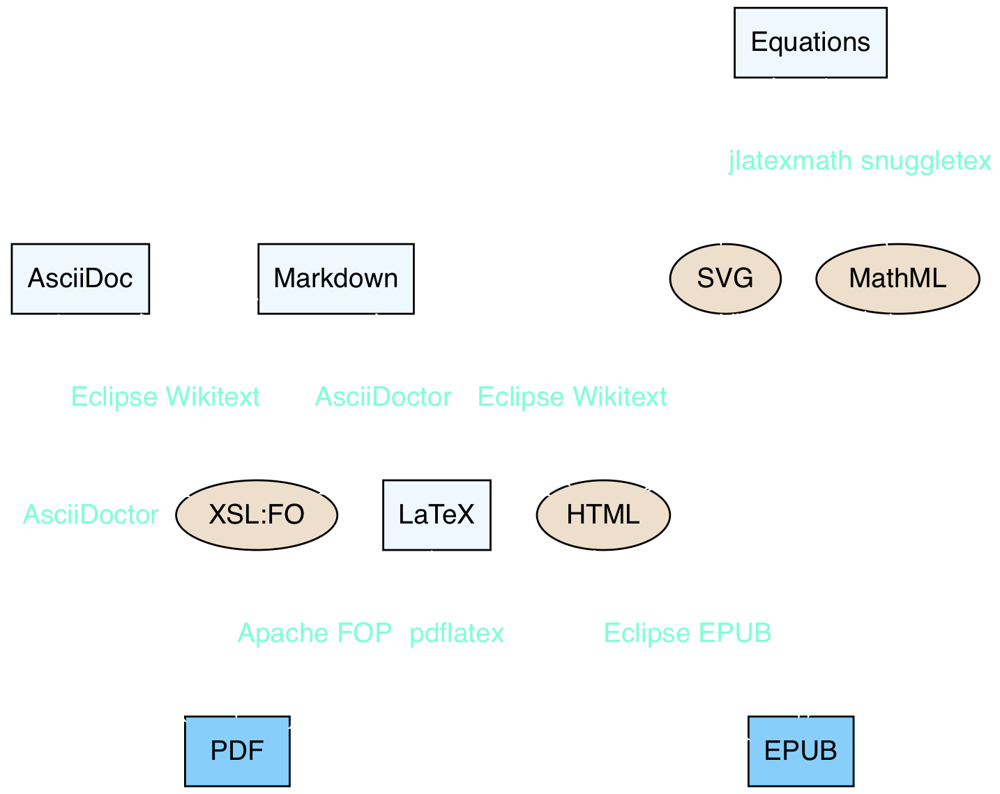

autoscale: true

# [fit] **Building Documents**
## [fit] in a Java world

---
# Torkild Ulvøy Resheim

* Part owner & Senior Software Engineer at Itema AS
* A few roles at Eclipse Foundation:
    - Eclipse Board of Directors Member
    - Eclipse Architecture Council Member
	- Science Working Group Steering Committee
	- Science Project Management Committee
	- TeXlipse project lead
	- Committer at Mylyn Docs, Mylyn Builds, TeXlipse

---
# Producing documents using Java

Java has a **huge** selection of open source API's and tools:

* Templating engines
* Wide range of source types and result formats
* Conversion tools (we'll look at some)
* Editors in Eclipse

^ **Templating engines** Apache Freemarker

---
# From source to production[^1]

^ **Markdown** is quite common in relation to source code: Easy to learn, plain text, does not have to be rendered to be useful

^ **AsciiDoc** is great for writing user guides and books: A bit steeper learning curve, does not have to be rendered. Great tools.

^ **LaTeX** is the only sensible choice when writing math.

^ **EPUB** is Portable and reflowable, fits different screen sizes. Supports MathML and SVG, base format is HTML. Can be made interactive (using SVG, CSS and JavaScript)

^ PDF:  What you get is exactly what you wanted. Fixed layout, not suitable for wide range of screen sizes.

^ It is also possible to for instance generate Office Open XML documents using a customized Mylyn Docs DocumentBuilder. I think the code I wrote for that is on GitHub. 

|              | PDF                           | EPUB                         | Editor               | Usage                |
| ------------ | ----------------------------- | ---------------------------- | -------------------- | -------------------- |
| **Markdown** | Eclipse WikiText + Apache FOP | Eclipse Docs WikiText + EPUB | Eclipse (Mylyn Docs) | Project docs, wikis  |
| **AsciiDoc** | AsciiDoctor, JRuby            | AsciiDoctor + Mylyn WikiText | VS Code              | User guides, books   |
| **LaTeX**    | pdflatex                      | TeX2ht + Mylyn WikiText      | Eclipse (TeXlipse)   | Papers, publications |

[^1]: Some of my preferred toolchains

---
# Conversion tools

^ **Light blue** are source formats.

^ **Beige** are intermediate formats in this demo 

^ **Blue** are end result formats.

---
# Useful Eclipse plug-ins

* Eclipse TeXlipse
* Eclipse Mylyn Docs (WikiText & EPUB) 
* Eclipse GEF (Graphical Editing Framework)
* Torkild's Equation Editor

---
# [fit] **Time for a**
# [fit] *DEMO*

^ Graphviz Dot Diagram editing: Simple editor with a native preview. Has a few bugs I found yesterday. Remove colours to make it obvious how usable it is.

^ Basic Markdown editing. Images, SVG (show XML content).

^ Equation editing using equation editor

^ Markdown generator code -> Generate PDF and EPUB

^ Show VS Code with AsciiDoc + end result

^ Quick demo of TeXlipse.

^ This presentation was written in Markdown

---
# [fit] *Thank You!*
# [fit] 🐦 torkildr on Twitter
# [fit] ✉️ tur@itema.no
## [fit] 💾 **https://git.io/v5Leq**
